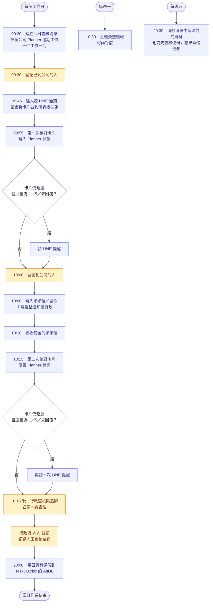
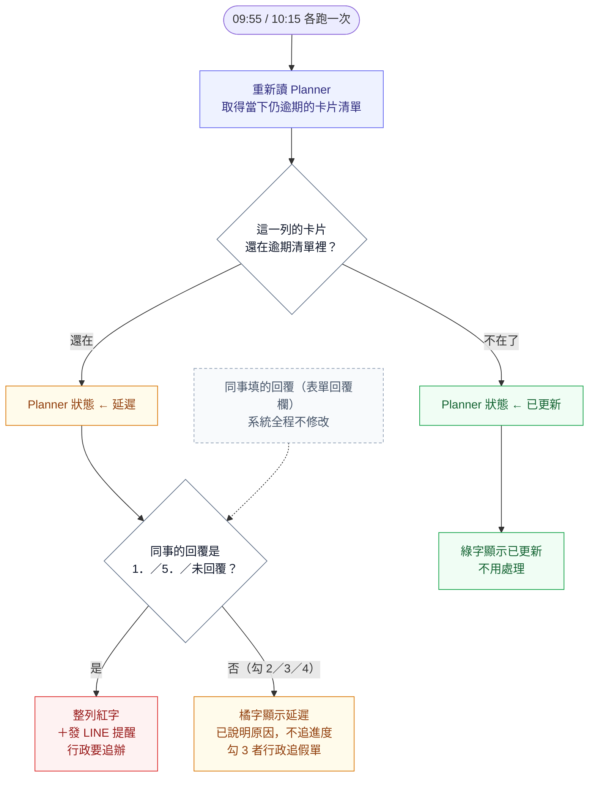
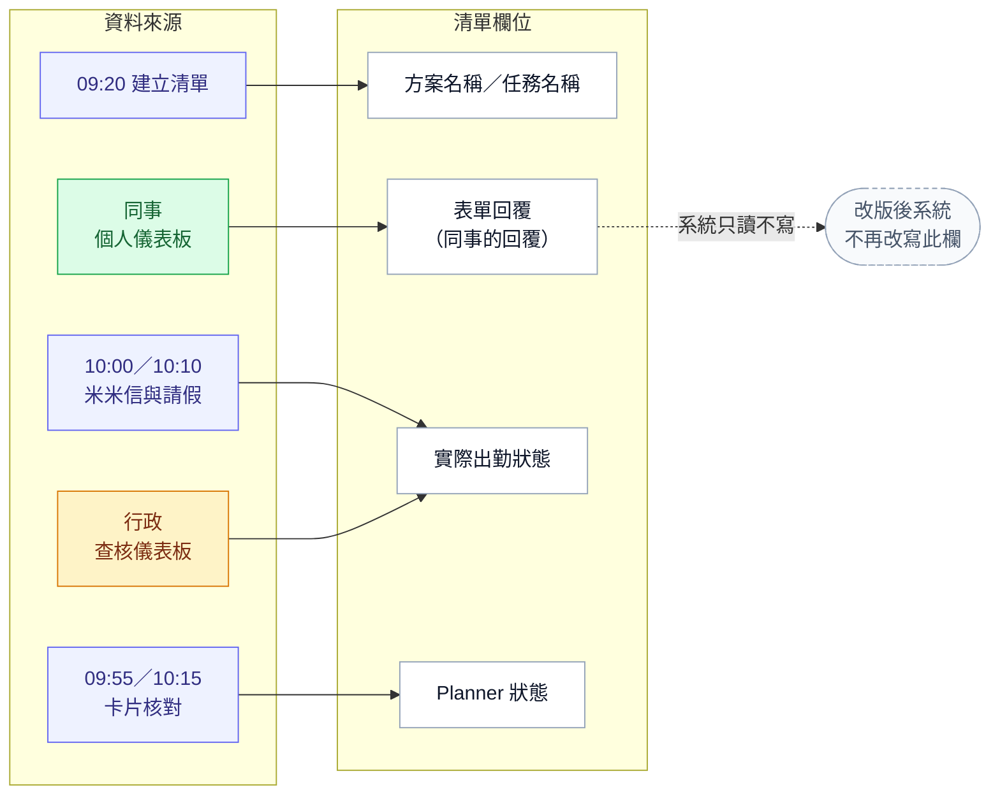
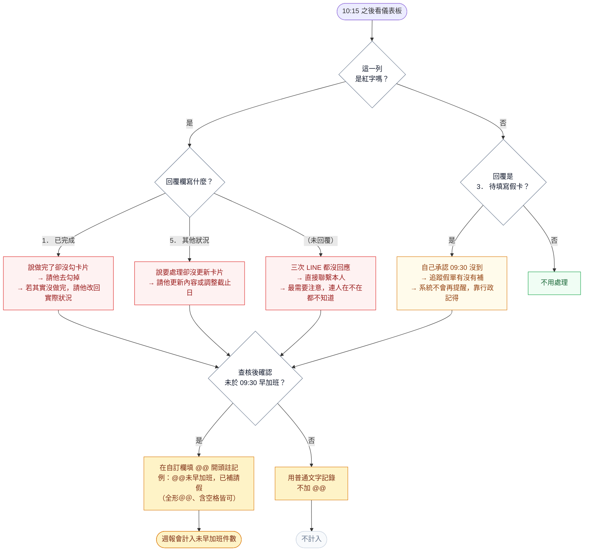
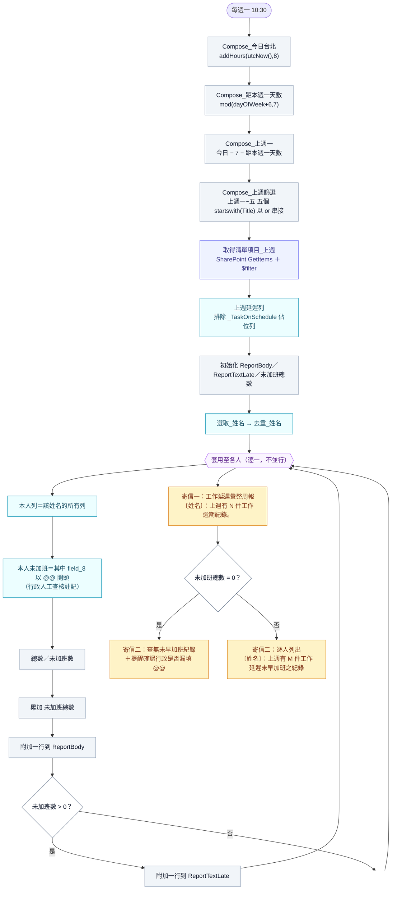
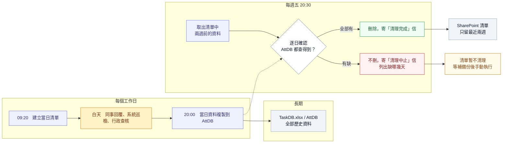

# 出勤查核系統 流程圖（Mermaid）2026-08-04

> 貼進支援 Mermaid 的地方即可算圖：Obsidian、Notion、GitHub、HackMD、VS Code Mermaid 外掛，
> 或線上編輯器 <https://mermaid.live>。

---

## 圖一：每日時間軸（總覽）

---

## 圖二：Planner 狀態怎麼判定、什麼時候變紅字

---

## 圖三：兩個欄位的資料來源（誰寫什麼）

---

## 圖四：行政追辦的四種情況

> `@@` 註記填在「行政人員輸入」右邊的自訂輸入框（提示文字為「自訂／未早加班打 @@」），
> 打完自動存檔。判定含全形／半形／空格容錯，`＠＠`、`@ @`、前面有空格都認得，單一個 `@` 不算。
> 這是少數事件（至 2026-08-04 尚未發生過），因此未做成下拉選項。

---

## 圖五：1030 週報的內部動作（給系統維護者）

> **注意**：圖五的「未加班」判定 2026-08-04 已定案為**只認行政填的 `@@` 註記**（`field_8` 前綴）。
> 同事自己在儀表板勾的內容不影響這個數字——行政沒填，該筆就不會出現在週報上。
>
> 兩封信的**主旨格式固定不可更動**（後續要由 Planner2Line 解析後轉發 LINE）：
> 信一 `上周 (MM/dd ~ MM/dd) 工作延遲彙整周報`、信二 `工作延遲早加班狀況_上周 (MM/dd ~ MM/dd) `（結尾有一個半形空格）。

---

## 圖六：資料保存與備份週期

> **對行政的影響**：出勤查核 App 讀的是 SharePoint 清單，兩週前的資料在 App 上會查不到，
> 要查更早的紀錄請開 `TaskDB.xlsx` 的 `AttDB` 工作表。
>
> 清理流程收到「清理中止」信時，代表當天的備份沒跑成功或有缺日，**清單資料不會被刪**，
> 補跑複製流程後再手動執行一次清理即可。通知信寄給 `domain.e` 與 `ihueychen`。
